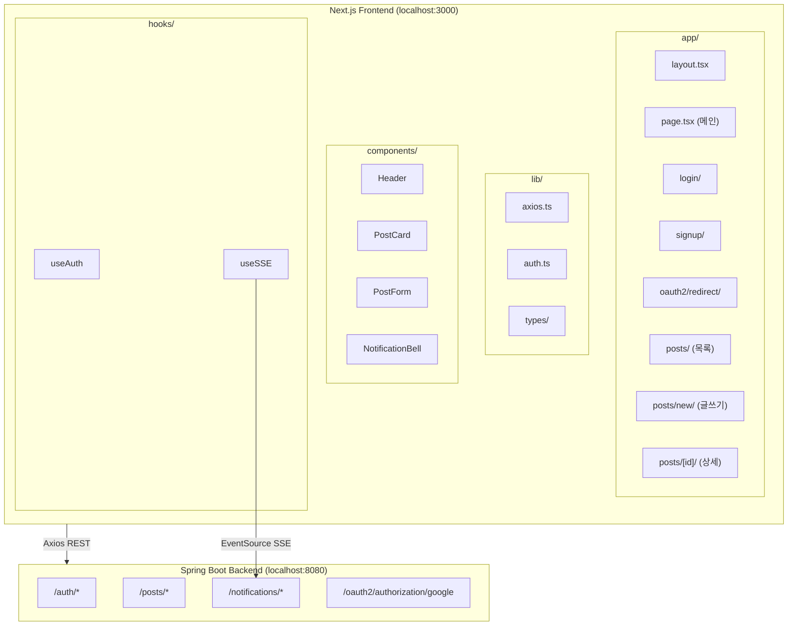

# Frontend Core Lab - 구현 계획서

> 백엔드 API 연동 Next.js 프론트엔드 프로젝트 구현 계획  
> 협업 프론트엔드 개발자를 위한 가이드 문서

---

## 1. 프로젝트 개요

### 1.1 기술 스택
| 구분 | 기술 |
|------|------|
| Framework | Next.js 14+ (App Router) |
| Styling | Tailwind CSS |
| HTTP Client | Axios |
| 백엔드 Base URL | `http://localhost:8080` |

### 1.2 백엔드 도메인별 기능 정리

| 도메인 | 기능 | API 엔드포인트 | 인증 |
|--------|------|----------------|------|
| **Auth** | 회원가입 | `POST /auth/signup` | ❌ |
| | 로그인 | `POST /auth/login` | ❌ |
| | 로그아웃 | `POST /auth/logout` | ✅ Bearer |
| | 토큰 갱신 | `POST /auth/refresh` | ❌ |
| | OAuth2 Google | `GET /oauth2/authorization/google` | ❌ |
| **Post** | 게시글 작성 | `POST /posts` | ✅ Bearer |
| | 목록 조회 | `GET /posts` | ✅ Bearer |
| | 상세 조회 | `GET /posts/{postId}` | ✅ Bearer |
| | 수정 | `PUT /posts/{postId}` | ✅ Bearer |
| | 삭제 | `DELETE /posts/{postId}` | ✅ Bearer |
| | 좋아요 토글 | `POST /posts/{postId}/like` | ✅ Bearer |
| **Notification** | SSE 구독 | `GET /notifications/subscribe?token={accessToken}` | Query Param |
| | 알림 목록 | `GET /notifications` | ✅ Bearer |
| | 읽지 않은 알림 | `GET /notifications/unread` | ✅ Bearer |
| | 읽음 처리 | `PATCH /notifications/{id}/read` | ✅ Bearer |

### 1.3 좋아요 → 작성자 알림 연동 (백엔드 자동 처리)

**사용자 A가 사용자 B의 게시글에 좋아요를 누르면, 작성자(B)에게 알림이 전송됩니다.**

| 구분 | 담당 | 설명 |
|------|------|------|
| **알림 생성** | 백엔드 | `POST /posts/{postId}/like` 호출 시, 본인 글이 아니면 백엔드가 자동으로 `NotificationService.createNotification()` 호출 |
| **알림 수신** | 프론트 Phase 6 | 작성자(B)의 브라우저가 SSE로 구독 중이면 실시간으로 `"A님이 회원님의 게시글을 좋아합니다"` 알림 수신 |
| **알림 표시** | 프론트 Phase 6 | `NotificationBell` 컴포넌트에서 드롭다운으로 표시 |

> 본인 글이면 알림이 생성되지 않으며, 좋아요 취소 시에도 알림은 생성되지 않습니다.

---

## 2. 전체 아키텍처

### 2.1 Mermaid 다이어그램 (뷰어 지원 시)



### 2.2 ASCII 아키텍처

```
┌─────────────────────────────────────────────────────────────────────────────────┐
│                         FRONTEND (Next.js App Router)                             │
├─────────────────────────────────────────────────────────────────────────────────┤
│                                                                                   │
│  ┌─────────────────────────────────────────────────────────────────────────┐    │
│  │                        app/ (App Router)                                  │    │
│  │  ┌─────────────┐  ┌─────────────┐  ┌─────────────┐  ┌─────────────────┐ │    │
│  │  │ layout.tsx  │  │ page.tsx    │  │ login/      │  │ oauth2/redirect/ │ │    │
│  │  │ (공통 레이아웃)│  │ (메인/게시판) │  │ signup/    │  │ (OAuth 콜백)     │ │    │
│  │  └─────────────┘  └─────────────┘  └─────────────┘  └─────────────────┘ │    │
│  │  ┌─────────────┐  ┌─────────────┐  ┌─────────────┐                       │    │
│  │  │ posts/      │  │ posts/new/  │  │ posts/[id]/ │                       │    │
│  │  │ (목록)       │  │ (글쓰기)    │  │ (상세/수정)  │                       │    │
│  │  └─────────────┘  └─────────────┘  └─────────────┘                       │    │
│  └─────────────────────────────────────────────────────────────────────────┘    │
│                                                                                   │
│  ┌─────────────────────────────────────────────────────────────────────────┐    │
│  │                     lib/ (유틸리티 & 설정)                                │    │
│  │  ┌──────────────┐  ┌──────────────┐  ┌──────────────┐                    │    │
│  │  │ axios.ts     │  │ auth.ts      │  │ types/       │                    │    │
│  │  │ (API 클라이언트)│  │ (토큰 관리)  │  │ (DTO 타입)   │                    │    │
│  │  └──────────────┘  └──────────────┘  └──────────────┘                    │    │
│  └─────────────────────────────────────────────────────────────────────────┘    │
│                                                                                   │
│  ┌─────────────────────────────────────────────────────────────────────────┐    │
│  │                     components/ (UI 컴포넌트)                             │    │
│  │  ┌──────────────┐  ┌──────────────┐  ┌──────────────┐  ┌──────────────┐  │    │
│  │  │ Header.tsx   │  │ PostCard.tsx │  │ PostForm.tsx │  │ Notification │  │    │
│  │  │ (네비게이션)  │  │ (게시글 카드) │  │ (글쓰기폼)   │  │ Bell.tsx     │  │    │
│  │  └──────────────┘  └──────────────┘  └──────────────┘  └──────────────┘  │    │
│  └─────────────────────────────────────────────────────────────────────────┘    │
│                                                                                   │
│  ┌─────────────────────────────────────────────────────────────────────────┐    │
│  │                     hooks/ (커스텀 훅)                                    │    │
│  │  ┌──────────────┐  ┌──────────────┐                                       │    │
│  │  │ useAuth.ts   │  │ useSSE.ts    │  (알림 실시간 구독)                    │    │
│  │  │ (인증 상태)   │  │              │                                       │    │
│  │  └──────────────┘  └──────────────┘                                       │    │
│  └─────────────────────────────────────────────────────────────────────────┘    │
│                                                                                   │
└─────────────────────────────────────────────────────────────────────────────────┘
                                        │
                                        │ Axios (REST) + EventSource (SSE)
                                        ▼
┌─────────────────────────────────────────────────────────────────────────────────┐
│                    BACKEND (Spring Boot - localhost:8080)                         │
│  /auth/*  │  /posts/*  │  /notifications/*  │  /oauth2/authorization/google     │
└─────────────────────────────────────────────────────────────────────────────────┘
```

---

## 3. 디렉토리 구조 (목표)

```
frontend-core-lab/
├── app/
│   ├── layout.tsx              # 루트 레이아웃 (Header 포함)
│   ├── page.tsx                 # 메인 → 게시판 목록 리다이렉트
│   ├── globals.css
│   ├── login/
│   │   └── page.tsx            # 로그인 페이지
│   ├── signup/
│   │   └── page.tsx            # 회원가입 페이지
│   ├── oauth2/
│   │   └── redirect/
│   │       └── page.tsx        # OAuth2 콜백 (토큰 저장 후 리다이렉트)
│   ├── posts/
│   │   ├── page.tsx            # 게시판 목록
│   │   ├── new/
│   │   │   └── page.tsx        # 글쓰기
│   │   └── [id]/
│   │       └── page.tsx        # 상세/수정
│   └── notifications/
│       └── page.tsx            # 알림 목록 (선택)
├── components/
│   ├── Header.tsx              # 네비게이션 + 알림 아이콘
│   ├── PostCard.tsx            # 게시글 카드
│   ├── PostForm.tsx            # 글쓰기/수정 폼
│   └── NotificationBell.tsx    # 알림 드롭다운
├── lib/
│   ├── axios.ts                # Axios 인스턴스 (인터셉터: 토큰, 401→refresh)
│   ├── auth.ts                 # 토큰 저장/조회/삭제
│   └── types/
│       └── index.ts            # API DTO 타입 정의
├── hooks/
│   ├── useAuth.ts              # 로그인 상태, 로그아웃
│   └── useSSE.ts               # SSE 알림 구독
├── .env.local                  # NEXT_PUBLIC_API_URL=http://localhost:8080
├── package.json
├── tailwind.config.ts
└── tsconfig.json
```

---

## 4. 단계별 구현 계획

### Phase 0: 프로젝트 초기화
- Next.js 프로젝트 생성 (App Router, TypeScript, Tailwind, ESLint)
- Axios 설치
- `.env.local`에 `NEXT_PUBLIC_API_URL=http://localhost:8080` 설정
- **Commit**: `chore: Next.js 프로젝트 초기 설정 (Tailwind, Axios)`

---

### Phase 1: 인프라 & 타입 정의
- `lib/types/index.ts`: 백엔드 DTO 기반 TypeScript 타입 정의
- `lib/auth.ts`: localStorage 기반 토큰 저장/조회/삭제
- `lib/axios.ts`: Axios 인스턴스 + 요청 인터셉터(Authorization) + 401 시 refresh 시도
- **Commit**: `feat: API 타입 정의 및 Axios 클라이언트 설정`

---

### Phase 2: 인증 (로그인/회원가입)
- `app/login/page.tsx`: 로그인 폼 (username, password)
- `app/signup/page.tsx`: 회원가입 폼 (username, email, password)
- `app/oauth2/redirect/page.tsx`: OAuth2 콜백 처리 (token, refreshToken 쿼리 파라미터)
- `hooks/useAuth.ts`: 로그인/로그아웃, 토큰 갱신 로직
- `components/Header.tsx`: 로그인 시 사용자명 표시, 로그아웃 버튼
- **Commit**: `feat: 로그인/회원가입/OAuth2 리다이렉트 및 JWT 관리`

---

### Phase 3: 게시판 목록 & 글쓰기
- `app/posts/page.tsx`: 게시글 목록 조회 (GET /posts)
- `components/PostCard.tsx`: 게시글 카드 UI (제목, 작성자, 좋아요 수, 날짜)
- `app/posts/new/page.tsx`: 글쓰기 폼 (POST /posts)
- `components/PostForm.tsx`: 제목/내용 입력 폼 (재사용)
- **Commit**: `feat: 게시판 목록 조회 및 글쓰기 기능`

---

### Phase 4: 게시글 상세 & 수정/삭제
- `app/posts/[id]/page.tsx`: 상세 조회 (GET /posts/{id}), 수정/삭제 버튼 (작성자만)
- 수정: PUT /posts/{id}, 삭제: DELETE /posts/{id}
- **Commit**: `feat: 게시글 상세 조회 및 수정/삭제`

---

### Phase 5: 좋아요
- `PostCard` 또는 상세 페이지에 좋아요 버튼 추가
- POST /posts/{postId}/like 호출 후 목록/상세 데이터 갱신
- **Commit**: `feat: 게시글 좋아요 토글 기능`
- > 💡 **연동**: 이 API 호출 시 백엔드가 작성자에게 알림을 자동 생성 → Phase 6에서 SSE로 수신·표시

---

### Phase 6: 알림 (SSE)
- `hooks/useSSE.ts`: EventSource로 `/notifications/subscribe?token={accessToken}` 구독
- `components/NotificationBell.tsx`: 헤더에 알림 아이콘, 드롭다운으로 목록 표시
- 새 알림 수신 시 실시간 반영, PATCH로 읽음 처리
- **Commit**: `feat: SSE 기반 실시간 알림 기능`
- > 💡 **연동**: Phase 5(좋아요)로 인해 생성된 알림을 실시간으로 수신·표시 (예: "user2님이 회원님의 게시글을 좋아합니다")

---

## 5. API 타입 정의 (백엔드 DTO 매핑)

```typescript
// lib/types/index.ts 예시

// Auth
export interface LoginRequest { username: string; password: string; }
export interface SignupRequest { username: string; email: string; password: string; }
export interface LoginResponse {
  accessToken: string;
  refreshToken: string;
  username: string;
  email?: string;
  role: 'USER' | 'ADMIN';
  userId?: number;
}
export interface RefreshRequest { refreshToken: string; }
export interface RefreshResponse { accessToken: string; refreshToken?: string; }

// Post
export interface CreatePostRequest { title: string; content: string; }
export interface UpdatePostRequest { title: string; content: string; }
export interface PostResponse {
  id: number;
  title: string;
  content: string;
  authorName: string;
  likeCount: number;
  createdAt: string;
  updatedAt: string;
}
export interface PostListResponse { posts: PostResponse[]; totalCount: number; }

// Notification
export interface NotificationResponse {
  id: number;
  message: string;
  postId: number;
  isRead: boolean;
  createdAt: string;
}
```

---

## 6. 주요 구현 포인트

### 6.1 JWT 토큰 관리
- **저장**: `localStorage` (accessToken, refreshToken)
- **요청 시**: Axios 인터셉터에서 `Authorization: Bearer {accessToken}` 자동 첨부
- **401 발생 시**: `/auth/refresh`로 accessToken 갱신 후 재요청 (RefreshResponse에 refreshToken 포함 여부 확인 필요 - API 스펙상 accessToken만 반환)

> ⚠️ **참고**: 백엔드 `RefreshResponse`는 `accessToken`만 반환합니다. refreshToken은 갱신 시 새로 발급되지 않을 수 있으므로, 기존 refreshToken 유지.

### 6.2 SSE (알림)
- 브라우저 `EventSource`는 **헤더 설정 불가** → `?token={accessToken}` 쿼리 파라미터 사용
- URL: `http://localhost:8080/notifications/subscribe?token=${accessToken}`
- 이벤트: `connect`, `notification`

### 6.3 OAuth2 리다이렉트
- 백엔드 성공 시: `http://localhost:3000/oauth2/redirect?token={accessToken}&refreshToken={refreshToken}` 로 리다이렉트
- `oauth2/redirect` 페이지에서 쿼리 파라미터 추출 → localStorage 저장 → `/posts`로 이동

### 6.4 인증 필요 페이지
- `/posts`, `/posts/new`, `/posts/[id]` 등: 토큰 없으면 `/login`으로 리다이렉트

---

## 7. 다음 단계

**Phase 0 (프로젝트 초기화)** 부터 진행합니다.  
각 Phase 완료 후 commit 메시지를 입력하고, 허락을 받은 뒤 다음 단계로 진행합니다.

---

*작성일: 2026-02-18*
